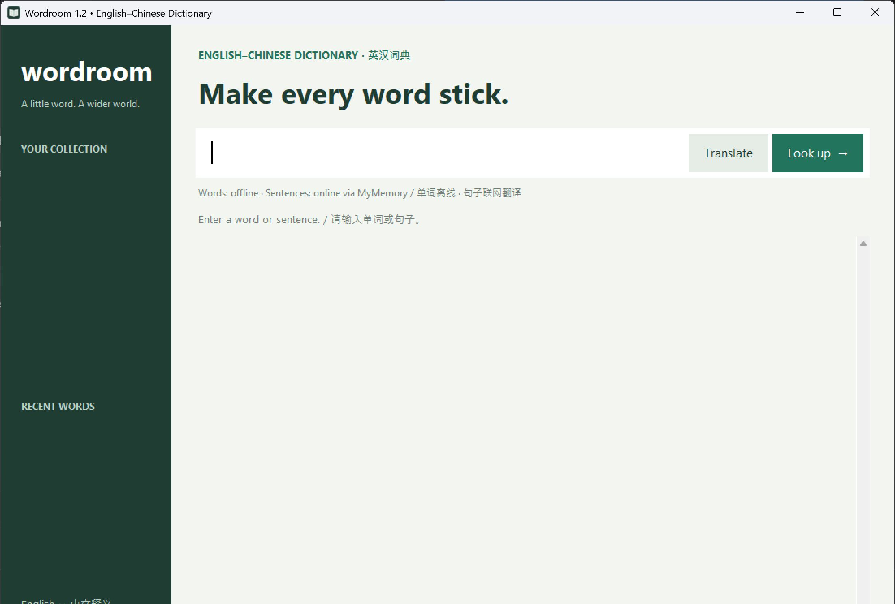

# Wordroom

A local English–Chinese dictionary for **Windows 10/11 x64 (Intel/AMD)**.



## Download and install

Get the **[Wordroom 1.2.1 installer](https://github.com/WeipingWu2023/wordroom/releases/tag/v1.2.1)** from GitHub Releases. Download `Wordroom-Setup-1.2.1-Windows-x64.exe`, run it, and open the new desktop or Start menu shortcut. Python and administrator rights are not required.

The installer is **unsigned**: Windows may show an unknown-publisher or SmartScreen warning. `SHA256SUMS.txt` in the same release lets you check the download with:

```powershell
Get-FileHash .\Wordroom-Setup-1.2.1-Windows-x64.exe -Algorithm SHA256
```

Compare the hash to the checksum file. GitHub's automatic **Source code ZIP is not the installer**.

## Features

- 770,611 offline ECDICT entries, with Chinese definitions where available.
- English meanings, synonyms, antonyms and available examples from WordNet 3.0.
- Fast indexed local searches; optional online details run separately.
- Many inflected words resolve to a base form, such as peasants → peasant.
- Save words to a personal collection and revisit recent searches.
- Blank startup: enter your own word or sentence.
- Sentence translation between English and Chinese through Google Translate (internet required).
- Three meanings/related words initially; show more on demand. Empty sections are hidden.
- Click an abbreviated explanation to expand it; translations can be selected or copied.

Type a word or sentence and press Enter. Known dictionary phrases stay offline;
other multiword input is translated online. Use Translate to force translation.
Ctrl+L focuses the search box. Click a related word to explore it.

## Privacy, updates and saved words

Dictionary lookups work offline. Clicking **Online details** sends that word to
`api.dictionaryapi.dev`; successful responses are cached locally. Sentence
translation sends the submitted text to `translate.googleapis.com`. The app
states this below the search box. Translations are cached only in memory for the
current session (up to 50), not in saved words or disk caches. No account or API
key is needed. Avoid submitting confidential text to a public translation service.

The program installs to `%LOCALAPPDATA%\Programs\Wordroom`. Your collection and lookup cache are separate, in `%LOCALAPPDATA%\Wordroom` (`saved.json` and `cache/`). Copy that data folder somewhere safe to back it up. Updating through the installer preserves it. Uninstalling also leaves it in place. The repository and installer contain no personal saved words or lookup caches. Recent-search buttons are session-only.

There is no automatic updater. Download and run a newer installer when a release becomes available.

## Known limitations

Dictionary coverage is not exhaustive. Missing definitions, examples and relationships
are omitted. Chinese headword definitions are not translations of every English
example. Related-word explanations can describe another sense. Sentence translation
needs internet, accepts at most 500 UTF-8 bytes per request, and is subject to
the provider's rate limits. The public Google Translate web endpoint is not the
supported Google Cloud API: it can change or be blocked, including on some networks
in mainland China. There is no automatic fallback to MyMemory. Machine translations
may still miss idioms or context; this update improves the tested examples, not every
possible sentence. Online services
may fail; local word lookup continues working. There is no automatic spelling
correction. Windows ARM, 32-bit Windows, macOS and Linux are not supported release targets.

## Run from source (developers)

Use **Python 3.12.10 x64 with Tcl/Tk** on Windows (the standard python.org installer). Start in the repository root. Runtime code uses Python's standard library; no third-party runtime package is needed.

```powershell
git clone https://github.com/WeipingWu2023/wordroom.git
cd wordroom
python -m venv .venv
.\.venv\Scripts\python.exe packaging/fetch_data.py
.\.venv\Scripts\python.exe packaging/build_dictionary.py
.\.venv\Scripts\python.exe dictionary.py
```

The first data download requires internet access. The large database is deliberately not tracked by Git. [Data instructions](data/README.md) describe the pinned sources, checksum verification, and generation. The original small starter entries are also bundled. `Start Wordroom.vbs` is an optional source launcher when `pythonw.exe` is on PATH.

## Test

Generate the database first, then run:

```powershell
.\.venv\Scripts\python.exe -m unittest -v
.\.venv\Scripts\python.exe packaging/check_ui.py
```

The UI test needs an interactive Windows desktop. It uses a temporary data folder, not your saved collection. Tests cover offline and cached lookup, Chinese display, inflections, missing words, network errors, relationships, pagination, and local search during a stalled online request.

## Build the Windows installer

Install **Inno Setup 6.7.3** from [its official website](https://jrsoftware.org/isdl.php), then install the pinned Python build requirements:

```powershell
.\.venv\Scripts\python.exe -m pip install -r requirements-build.txt
.\packaging\build.ps1 -Python .\.venv\Scripts\python.exe -InnoCompiler "C:\Program Files (x86)\Inno Setup 6\ISCC.exe"
```

The compiler path above is a standard installation example; pass your own location if different. The script verifies/downloads source data, generates the database and icon, runs automated tests, bundles the app, builds the installer, and writes `release/SHA256SUMS.txt`. Run the UI test separately before releasing. Outputs under `build/`, `dist/`, and `release/` are ignored by Git. Setup keeps a stable AppId so updates use the existing installation.

Version 1.2.1 uses Python 3.12.10, PyInstaller 6.22.3, Pillow 12.2.0 and Inno Setup 6.7.3. Update runtime notices if changing those components. The scripts produce functionally reproducible packages, not a guarantee of byte-identical executables.

## Source and data licenses

Wordroom's original code, starter entries and icon are [MIT licensed](LICENSE). The offline database contains separately licensed [ECDICT](https://github.com/skywind3000/ECDICT) and [WordNet 3.0](https://wordnet.princeton.edu/) data; it is not wholly covered by Wordroom's MIT license. Full attribution and runtime notices are in [THIRD_PARTY_NOTICES.md](THIRD_PARTY_NOTICES.md) and [packaging/licenses](packaging/licenses).

The database contains 770,611 ECDICT entries, 206,941 WordNet word/sense records and 62,101 aliases. These overlapping record counts must not be added together as unique words.

See [CHANGELOG.md](CHANGELOG.md) and the [1.2.1 release notes](docs/release-1.2.1.md).
The [1.1.0 milestone](docs/release-1.1.0.md) remains available. Report problems
through GitHub Issues; do not include saved words, confidential sentences,
credentials or personal installation logs.
