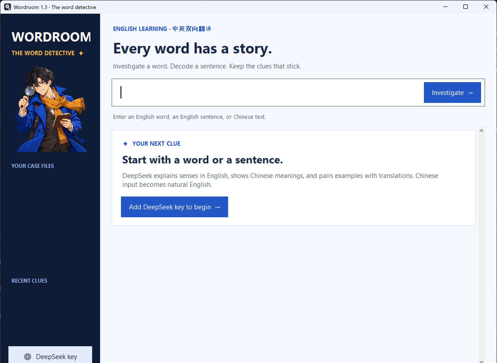

# LanGo

LanGo 1.3 is a Windows 10/11 x64 desktop app for learning English with DeepSeek. Its detective theme uses an original character and a new magnifying-glass icon.



## Install

Download the [LanGo 1.3.1 release](https://github.com/WeipingWu2023/wordroom/releases/tag/v1.3.1), run `LanGo-Setup-1.3.1-Windows-x64.exe`, and open LanGo from the desktop or Start menu. Python and administrator rights are not needed. The installer is unsigned, so Windows may show an unknown-publisher warning. Compare the installer SHA-256 hash with `SHA256SUMS.txt` in the release.

The app has no API-key prompt. Configure `DEEPSEEK_API_KEY` in the Windows user's environment before launching it; the app reads it behind the scenes. Each person who installs LanGo needs their own key. Never put a key in the installer or repository. [DeepSeek's official API guide](https://api-docs.deepseek.com/guides/harness) explains account setup. DeepSeek charges for API use; check [current model prices](https://api-docs.deepseek.com/quick_start/pricing/) before heavy use.

## Study with LanGo

- Enter an English word to get detailed English definitions grouped by sense and part of speech, Chinese explanations, usage notes, and at least three example sentence pairs per sense. Synonyms and antonyms appear only when relevant.
- Enter an English sentence for a natural Chinese translation.
- Enter Chinese text for faithful, fluent English.
- Save English words to your existing collection. Sentences are not saved.

Every result comes from `api.deepseek.com` using the `deepseek-flash` model. LanGo 1.3 does not use the old offline database, Free Dictionary API, MyMemory, or Google Translate. It needs internet access and a working local DeepSeek key for every lookup. AI explanations can still contain mistakes; verify important details. Very long or highly polysemous words may exceed one answer's length; retry with a more specific form if needed.

## Privacy and updates

Your entered text goes to DeepSeek for each lookup. The app does not save responses or API requests to disk. Saved words remain in `%LOCALAPPDATA%\LanGo\saved.json`, separate from the installed program. Updating LanGo preserves that folder. The old offline dictionary database may remain on disk after upgrading from 1.2; version 1.3 never reads it.

Your API key and saved words are personal data. Do not commit, upload, or send them to someone else. If a key was pasted into a chat or other shared place, revoke it and create a replacement in your [DeepSeek account](https://platform.deepseek.com/). Windows text rendering uses Segoe UI Variable Text, `tk scaling 1.25`, and a pre-scaled Lanczos character asset; Tk delegates glyph anti-aliasing to Windows rather than using CSS.

## Develop and build

Use Python 3.12 x64 on Windows. Runtime code uses the standard library. Clone this repository and run:

```powershell
python -m venv .venv
.\.venv\Scripts\python.exe lango_app.py
.\.venv\Scripts\python.exe -m unittest -v
.\.venv\Scripts\python.exe packaging/check_ui.py
```

To build the installer, install [Inno Setup 6](https://jrsoftware.org/isdl.php) and the pinned build dependencies, then run:

```powershell
.\.venv\Scripts\python.exe -m pip install -r requirements-build.txt
.\packaging\build.ps1 -Python .\.venv\Scripts\python.exe
```

The build produces `release/LanGo-Setup-1.3.1-Windows-x64.exe` and `release/SHA256SUMS.txt`. Build output and personal data are ignored by Git. The API key is entered by each user after installation. Run the UI check with a desktop session; it uses a temporary user-data directory and fake key.

LanGo code, the original detective artwork, and icon are [MIT licensed](LICENSE). Runtime and service notices are in [THIRD_PARTY_NOTICES.md](THIRD_PARTY_NOTICES.md). Earlier releases with ECDICT/WordNet remain available through their version tags and release assets; those datasets are not shipped in version 1.3. See [CHANGELOG.md](CHANGELOG.md).
